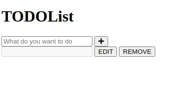

# Assignment-Todos-list-creation
This Application Created for Todo's task management. 
1. Users can create Todo's.
2. Users can see all the tasks.
3. Users can complete the tasks by clicking on checkbox button.

This project created in HTML, Bootstrap and JavaScript.

